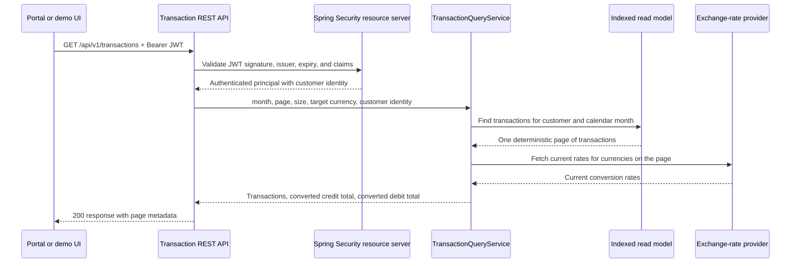
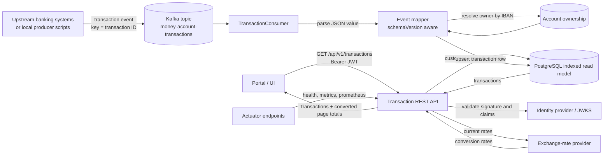

# E-Banking Transaction Service

Reusable Spring Boot REST API for returning a paginated list of money account transactions for the logged-on customer and a calendar month. The service consumes transaction events from Kafka into an indexed read model and returns page-level debit and credit totals converted with current exchange rates.

## What Is Implemented

- Java 17 Spring Boot service using Web, Kafka, Data JPA, Security, Actuator, and OpenAPI.
- `GET /api/v1/transactions?month=2020-10&page=0&size=50&targetCurrency=CHF`.
- JWT resource-server authentication. The customer identity is resolved from `customer_id`, `customerId`, or `sub`.
- Authorization by construction: the API never accepts a customer ID; it only queries rows for the identity in the JWT.
- Kafka ingestion from `money-account-transactions` into a relational read model.
- Efficient customer-month pagination using the `(customer_id, value_date desc, transaction_id)` index.
- Current exchange-rate lookup with a short in-memory cache and one retry.
- OpenAPI at `/v3/api-docs` and Swagger UI at `/swagger-ui.html`.
- Lightweight demo UI at `/` for querying the secured API from a browser.
- Health, readiness, liveness, metrics, and Prometheus actuator endpoints.
- Correlation IDs via `X-Request-Id`, with request/customer/transaction context added to structured logs.
- Dockerfile and Kubernetes/OpenShift manifests.
- CircleCI configuration running `mvn verify`.
- Testcontainers and local end-to-end smoke tests that exercise PostgreSQL, Kafka, exchange rates, JWT security, and the API response.

## Architecture Diagrams

The two most important diagrams are embedded directly in this README for review. Additional architecture notes are available under `docs/`, but they are not required to understand the main request and ingestion flows.

## API Request Flow

When the portal calls `GET /api/v1/transactions`, the service follows this runtime flow:



The customer ID is never accepted as a request parameter. It is taken only from the validated JWT, which prevents a caller from asking for another customer's transactions by changing the URL.

## Full Architecture

The service has two deliberately separate paths. The portal-facing path is a secured read API. The ingestion path is Kafka-based, where upstream transaction systems publish transaction events and this service consumes them into the read model used by the API.



Kafka remains the event source, while the relational read model exists for fast customer-month pagination. This keeps the online API query predictable even when customers have years of history and thousands of monthly transactions.

## How Transactions Enter The Service

The service exposes a read REST API for the portal. It does not expose a public REST endpoint for creating transactions. New or changed transactions enter the service through Kafka, because the transaction stream is owned by upstream banking systems such as core banking, card processing, or payment systems.

Each Kafka record uses:

- `key`: transaction ID, for example `89d3o179-abcd-465b-o9ee-e2d5f6ofEld46`
- `value`: JSON transaction payload containing amount, currency, IBAN, value date, and description

The consumer resolves the owning customer from the account-ownership table using the transaction IBAN, then upserts the transaction into the read model by transaction ID. Replaying the same Kafka event is therefore idempotent for the read model, and updated transaction data replaces the previous row for the same transaction ID.

This makes the REST API read path fast and authorization-friendly: when the portal calls the API, the service only needs to query `customer_id + month + page` from the indexed read model. It does not scan Kafka during an HTTP request.

In the local environment, transactions are added by scripts that simulate the upstream producer:

```bash
./scripts/publish-sample-transactions.sh
./scripts/generate-synthetic-transactions.sh
```

Those scripts publish Kafka records; the service consumes them and updates PostgreSQL. The UI then reads the resulting transactions through `GET /api/v1/transactions`.

For production, the equivalent producer would be an upstream banking application. The contract boundary for this service is the Kafka topic and event schema, while the public API remains read-only.

## Production Standards Coverage

| Engineering concern | How it is handled in this repository |
| --- | --- |
| API modeling | `TransactionController` exposes `GET /api/v1/transactions` with month, target currency, page, and size query parameters. The response uses explicit DTOs for transactions, converted totals, and pagination metadata. OpenAPI annotations document the endpoint, errors, and bearer-JWT security at `/v3/api-docs` and `/swagger-ui.html`; integration tests validate the published contract shape. |
| Authentication | Spring Security runs as an OAuth2 resource server. Production-style validation uses a JWKS URI through `JWT_JWK_SET_URI`; the local signed-JWT demo generates RS256 tokens and proves tampered tokens are rejected. |
| Authorization | The endpoint never accepts a customer ID parameter. `CustomerIdentityResolver` derives the logged-on customer from JWT claims, and `TransactionQueryService` queries only rows owned by that customer. |
| Calendar-month transaction retrieval | The API accepts `YYYY-MM` and converts it into an inclusive start date and exclusive end date. The current implementation uses `valueDate` because the simplified event model does not include a separate creation timestamp. |
| Pagination and deterministic ordering | Spring Data `PageRequest` is used with ordering by `valueDate desc, transactionId asc`. The response includes page number, size, total elements, and total pages. |
| Credit and debit totals | The service calculates totals for the current page only. Positive amounts are credits, negative amounts are debits returned as positive totals. |
| Exchange-rate integration | `ExternalExchangeRateClient` calls a configurable provider endpoint, retries once, and caches current rates briefly to reduce provider load. The local stack uses a mock exchange-rate provider. |
| Kafka event ingestion | `TransactionConsumer` listens to `money-account-transactions`; the Kafka message key is the transaction ID, and the JSON value is mapped into the read model. |
| Efficient data access | Kafka is used as the event source, while PostgreSQL/H2 is used as an indexed read model for online queries. The main index is `(customer_id, value_date desc, transaction_id)`. |
| Schema evolution | Transaction events contain `schemaVersion`, and Jackson ignores unknown JSON fields so additive changes do not break the consumer. Version-specific mappers can be added for breaking changes. |
| Logging | `X-Request-Id` is echoed back to callers and stored in MDC. API logs include request context, customer-scoped query logs include `customerId`, and Kafka ingestion logs include partition, offset, transaction ID, and owning customer. |
| Monitoring | Spring Boot Actuator exposes health, liveness, readiness, metrics, and Prometheus endpoints. |
| Testing strategy | Unit, integration, signed-JWT, API, OpenAPI contract, Testcontainers, and local smoke tests are included. CircleCI runs `mvn --batch-mode verify` on every pushed commit. |
| Container and platform deployment | `Dockerfile`, `docker-compose.yml`, Kubernetes manifests, HPA, and an OpenShift route are included under `k8s/`. |
| Documentation and architecture | This README embeds the two primary architecture diagrams directly. `docs/architecture.md` contains supplementary C4/context, component-flow, and data-model diagrams. `docs/decisions.md` records design decisions. |

## How To Review The Service

For a quick code review, start with these files:

- API and authorization: `src/main/java/com/ebanking/transactions/api/TransactionController.java`
- Customer identity from JWT: `src/main/java/com/ebanking/transactions/security/CustomerIdentityResolver.java`
- Kafka ingestion: `src/main/java/com/ebanking/transactions/kafka/TransactionConsumer.java`
- Query and page totals: `src/main/java/com/ebanking/transactions/service/TransactionQueryService.java`
- Exchange rates: `src/main/java/com/ebanking/transactions/exchange/ExternalExchangeRateClient.java`
- Request correlation: `src/main/java/com/ebanking/transactions/config/RequestCorrelationFilter.java`
- Read model schema and indexes: `src/main/resources/db/migration/V1__create_transaction_read_model.sql`
- Kubernetes/OpenShift deployment: `k8s/`
- Test coverage: `src/test/java/com/ebanking/transactions/` and `docs/test-plan.md`

For a functional review:

1. Run `mvn --batch-mode verify`.
2. Run `./scripts/start-signed-jwt-demo.sh`.
3. Open `http://localhost:8080/`.
4. Click `Signed JWTs`, select a customer, and click `Fetch`.
5. Confirm that changing the selected customer changes the visible transaction IDs and that the API never takes a customer ID as input.

## API Model

Request:

```http
GET /api/v1/transactions?month=2020-10&page=0&size=50&targetCurrency=CHF
Authorization: Bearer <jwt>
```

Response:

```json
{
  "transactions": [
    {
      "id": "89d3o179-abcd-465b-o9ee-e2d5f6ofEld46",
      "amount": { "amount": -100.00, "currency": "GBP" },
      "accountIban": "CH93-0000-0000-0000-0000-0",
      "valueDate": "2020-10-01",
      "description": "Online payment CHF"
    }
  ],
  "totalCredit": { "amount": 0.00, "currency": "CHF" },
  "totalDebit": { "amount": 113.40, "currency": "CHF" },
  "page": {
    "page": 0,
    "size": 50,
    "totalElements": 1,
    "totalPages": 1
  }
}
```

Positive amounts are treated as credits. Negative amounts are treated as debits and are returned as positive totals.

## Kafka Event

The Kafka event is the internal ingestion contract. It is not exposed as a public REST write endpoint.

Kafka key: transaction ID.

Kafka value:

```json
{
  "schemaVersion": 1,
  "amount": -100.00,
  "currency": "GBP",
  "accountIban": "CH93-0000-0000-0000-0000-0",
  "valueDate": "2020-10-01",
  "description": "Online payment CHF"
}
```

The consumer ignores unknown JSON fields to support additive schema evolution.

## Project Structure

```text
src/main/java/com/ebanking/transactions
  api/        REST DTOs, controller, error handling
  config/     OpenAPI, Jackson, and time configuration
  domain/     JPA entities and repositories
  exchange/   Exchange-rate client and conversion service
  kafka/      Kafka consumer and ingestion service
  security/   JWT customer identity handling and web security
  service/    Transaction query orchestration
src/main/resources/db/migration
  Flyway schema for account ownership and transaction read model
k8s/
  Kubernetes and OpenShift deployment resources
docs/
  Architecture and design decisions
```

## Local Run

```bash
mvn spring-boot:run
```

By default the app uses in-memory H2. For a production-like run, provide these environment variables:

```bash
DB_URL=jdbc:postgresql://localhost:5432/transactions
DB_USERNAME=transactions
DB_PASSWORD=secret
DB_DRIVER=org.postgresql.Driver
KAFKA_BOOTSTRAP_SERVERS=localhost:9092
JWT_JWK_SET_URI=https://identity.example.com/realms/ebanking/protocol/openid-connect/certs
EXCHANGE_RATE_BASE_URL=https://rates.example.com
```

## Local End-to-End Run

The repository includes Docker Compose for a local PostgreSQL database, Kafka broker, mock exchange-rate endpoint, and the transaction service.

Build the application jar first:

```bash
mvn package
```

Start the local stack:

```bash
docker compose up --build
```

In another terminal, seed demo account ownership:

```bash
./scripts/seed-local-db.sh
```

Publish sample Kafka transactions:

```bash
./scripts/publish-sample-transactions.sh
```

Generate a larger deterministic synthetic dataset through Kafka:

```bash
./scripts/generate-synthetic-transactions.sh
```

The generator defaults to 5 customers, 3 accounts per customer, 12 months from `2021-01`, and 12 transactions per account/month. Override the size with environment variables:

```bash
SYNTH_CUSTOMERS=10 SYNTH_MONTHS=24 SYNTH_TX_PER_ACCOUNT_MONTH=25 ./scripts/generate-synthetic-transactions.sh
```

Query the API with the local development token:

```bash
curl -H "Authorization: Bearer local-test-token" \
  "http://localhost:8080/api/v1/transactions?month=2020-10&page=0&size=20&targetCurrency=CHF"
```

Or open the browser UI:

```text
http://localhost:8080/
```

Use `local-test-token` with the local profile.

## Local Signed-JWT Demo

The `local` profile uses a fixed shortcut token for fast demos. To test the production-style JWT path locally, run the signed-JWT demo instead:

```bash
./scripts/start-signed-jwt-demo.sh
```

This generates a local RSA key pair, serves a JWKS document from `http://localhost:9098/.well-known/jwks.json`, and starts the app without the shortcut local `JwtDecoder`. Demo tokens are written to:

```text
local/identity/tokens.env
```

The browser UI can load the same generated tokens from the local identity service. Open `http://localhost:8080/`, click `Signed JWTs`, choose a customer, and click `Fetch`.

Load them in a shell:

```bash
source local/identity/tokens.env
```

Then call the API with a real RS256-signed JWT:

```bash
curl -H "Authorization: Bearer ${TOKEN_DEFAULT}" \
  "http://localhost:8080/api/v1/transactions?month=2021-01&page=0&size=20&targetCurrency=CHF"
```

The generated token mappings are:

```text
TOKEN_DEFAULT    -> P-0123456789
TOKEN_CUSTOMER_1 -> P-2000000001
TOKEN_CUSTOMER_2 -> P-2000000002
TOKEN_CUSTOMER_3 -> P-2000000003
TOKEN_CUSTOMER_4 -> P-2000000004
```

Expected behavior:

- The API returns only transactions owned by `P-0123456789`.
- The `tx-other-customer` message is ingested but not returned for the local token.
- GBP debit totals are converted using the mock exchange-rate endpoint at `http://localhost:9099/rates`.

Local ports:

```text
8080   transaction service
5432   PostgreSQL
29092  Kafka external listener
9099   mock exchange-rate endpoint
```

The local profile uses a fixed token only for laptop testing. Production deployments should use `JWT_JWK_SET_URI` and should not enable `SPRING_PROFILES_ACTIVE=local`.

## Build and Test

```bash
mvn verify
```

`mvn verify` includes unit tests, Spring integration tests, signed-JWT resource-server tests, OpenAPI contract checks, and Testcontainers tests for Kafka plus PostgreSQL. Docker must be available for the Testcontainers suite.

Run the local end-to-end smoke test:

```bash
./scripts/e2e-smoke-test.sh
```

The smoke test starts local dependencies, publishes sample Kafka transactions, calls the secured API, and verifies row-level authorization plus converted totals.

Build the image after the jar is produced:

```bash
mvn package
docker build -t transaction-service:0.1.0 .
```

## Kubernetes / OpenShift

```bash
kubectl apply -f k8s/configmap.yaml
kubectl apply -f k8s/secret.yaml
kubectl apply -f k8s/deployment.yaml
kubectl apply -f k8s/service.yaml
kubectl apply -f k8s/hpa.yaml
```

For OpenShift route exposure:

```bash
oc apply -f k8s/route-openshift.yaml
```

Replace the sample secrets with values from the target environment before deployment.

## Continuous Integration

The repository includes `.circleci/config.yml`. After pushing the repository and connecting it in CircleCI, the pipeline will run:

```bash
mvn --batch-mode verify
```

Successful CircleCI pipeline: [E-Bank_Portal build-test](https://app.circleci.com/pipelines/github/WilsonLiu2002/E-Bank_Portal).

## Supporting Documentation

- [Architecture notes](docs/architecture.md)
- [Design Decisions](docs/decisions.md)
- [Test Plan](docs/test-plan.md)
