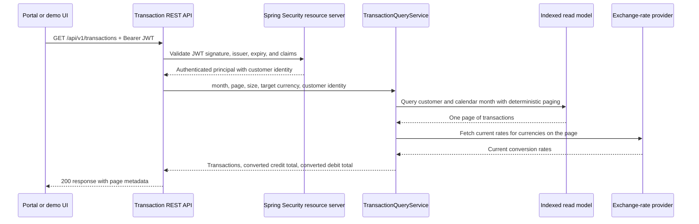
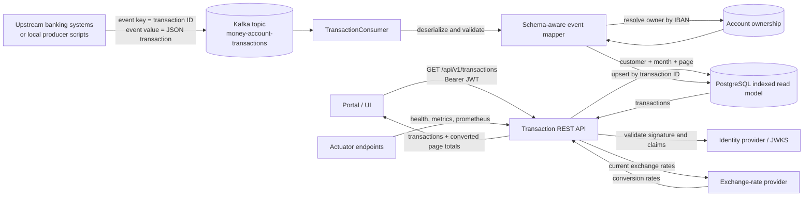

# E-Banking Transaction Service

Production-style Spring Boot microservice for transaction-history lookup in an e-banking portal. The service returns a paginated list of money-account transactions for the logged-in customer and a selected calendar month, with credit and debit totals for the returned page converted at current exchange rates.

The service is intentionally read-only from the portal point of view. Transaction data enters through Kafka, is stored in an indexed relational read model, and is queried through a secured REST API.

## Contents

- [What This Service Provides](#what-this-service-provides)
- [Quick Start](#quick-start)
- [Architecture](#architecture)
- [API Contract](#api-contract)
- [Authentication And Authorization](#authentication-and-authorization)
- [Kafka Ingestion](#kafka-ingestion)
- [Data Access And Indexing](#data-access-and-indexing)
- [Testing And Quality Gates](#testing-and-quality-gates)
- [Local Development](#local-development)
- [Docker, Kubernetes, And OpenShift](#docker-kubernetes-and-openshift)
- [Continuous Integration](#continuous-integration)
- [Project Structure](#project-structure)
- [Operational Notes](#operational-notes)
- [What Is Left For A Real Production Rollout](#what-is-left-for-a-real-production-rollout)

## What This Service Provides

| Area | Implementation |
| --- | --- |
| Runtime | Java 17, Spring Boot, Spring Web, Spring Kafka, Spring Data JPA, Spring Security, Actuator |
| API | `GET /api/v1/transactions` with `month`, `targetCurrency`, `page`, and `size` query parameters |
| Security | OAuth2 resource-server JWT validation through Spring Security |
| Authorization | Customer identity is taken from the validated JWT, never from a request parameter |
| Ingestion | Kafka consumer reads transaction events from `money-account-transactions` |
| Data access | PostgreSQL read model with indexes for customer-month pagination |
| Exchange rates | Configurable external exchange-rate client with retry and short in-memory cache |
| API documentation | OpenAPI JSON at `/v3/api-docs`, Swagger UI at `/swagger-ui.html` |
| Monitoring | Actuator health, liveness, readiness, metrics, and Prometheus endpoints |
| Logging | Correlation ID via `X-Request-Id`, request/customer/Kafka context in MDC logs |
| Delivery | Dockerfile, Docker Compose, Kubernetes manifests, OpenShift route, CircleCI pipeline |
| Verification | Unit, integration, Testcontainers, signed-JWT, OpenAPI contract, smoke, coverage, SpotBugs, and Checkstyle checks |

## Quick Start

Run the full verification suite:

```bash
mvn --batch-mode verify
```

Start the local signed-JWT demo:

```bash
./scripts/start-signed-jwt-demo.sh
```

Open the demo UI:

```text
http://localhost:8080/
```

In the UI, click `Signed JWTs`, choose a customer, then click `Fetch`. The browser calls the same secured REST endpoint that a portal client would call.

Useful local endpoints:

```text
Application UI    http://localhost:8080/
Swagger UI        http://localhost:8080/swagger-ui.html
OpenAPI JSON      http://localhost:8080/v3/api-docs
Health            http://localhost:8080/actuator/health
Prometheus        http://localhost:8080/actuator/prometheus
```

## Architecture

The service has two paths:

- The API path serves authenticated portal requests.
- The Kafka path keeps the read model up to date from transaction events.

### API Request Flow



The customer ID is not accepted in the URL. It is resolved from the validated JWT, which prevents a caller from switching to another customer's data by changing a query parameter.

### Whole-Service Architecture



Kafka is the ingestion boundary. PostgreSQL is the read model used to make online API queries fast, deterministic, and easy to authorize.

## API Contract

Request:

```http
GET /api/v1/transactions?month=2020-10&page=0&size=50&targetCurrency=CHF
Authorization: Bearer <jwt>
```

Response:

```json
{
  "transactions": [
    {
      "id": "89d3o179-abcd-465b-o9ee-e2d5f6ofEld46",
      "amount": { "amount": -100.00, "currency": "GBP" },
      "accountIban": "CH93-0000-0000-0000-0000-0",
      "valueDate": "2020-10-01",
      "description": "Online payment CHF"
    }
  ],
  "totalCredit": { "amount": 0.00, "currency": "CHF" },
  "totalDebit": { "amount": 113.40, "currency": "CHF" },
  "page": {
    "page": 0,
    "size": 50,
    "totalElements": 1,
    "totalPages": 1
  }
}
```

Important API behavior:

- `month` uses `YYYY-MM`.
- `page` is zero-based. `page=0` is the first page.
- `size` is the maximum number of rows returned in one page.
- Positive transaction amounts are credits.
- Negative transaction amounts are debits and are returned as positive debit totals.
- `totalCredit` and `totalDebit` are calculated only for the returned page.
- If the requested page is beyond the available rows, the API returns an empty `transactions` list with normal page metadata.

## Authentication And Authorization

The service uses Spring Security as an OAuth2 resource server. The application validates signed JWT access tokens using the configured JWKS endpoint:

```bash
JWT_JWK_SET_URI=https://identity.example.com/realms/ebanking/protocol/openid-connect/certs
```

The customer identity is resolved from one of these JWT claims:

```text
customer_id
customerId
sub
```

Authorization is enforced by query design:

1. Spring Security validates the token signature, expiry, and standard JWT structure.
2. `CustomerIdentityResolver` extracts the logged-in customer's identity from the authenticated principal.
3. `TransactionQueryService` queries by that customer identity plus the requested month.
4. The REST API never accepts `customerId` as an input parameter.

Local signed-JWT demo:

```bash
./scripts/start-signed-jwt-demo.sh
```

This script generates a local RSA key pair, serves a JWKS document from:

```text
http://localhost:9098/.well-known/jwks.json
```

It also writes demo tokens to:

```text
local/identity/tokens.env
```

Token mappings:

```text
TOKEN_DEFAULT    -> P-0123456789
TOKEN_CUSTOMER_1 -> P-2000000001
TOKEN_CUSTOMER_2 -> P-2000000002
TOKEN_CUSTOMER_3 -> P-2000000003
TOKEN_CUSTOMER_4 -> P-2000000004
```

Manual signed-JWT request:

```bash
source local/identity/tokens.env

curl -H "Authorization: Bearer ${TOKEN_DEFAULT}" \
  "http://localhost:8080/api/v1/transactions?month=2021-01&page=0&size=20&targetCurrency=CHF"
```

The local profile also supports `local-test-token` for fast development. Production-like demonstrations should use the signed-JWT flow.

## Kafka Ingestion

The portal API is read-only. Transactions are added or updated by publishing Kafka events.

Kafka topic:

```text
money-account-transactions
```

Kafka key:

```text
<transaction ID>
```

Kafka value:

```json
{
  "schemaVersion": 1,
  "amount": -100.00,
  "currency": "GBP",
  "accountIban": "CH93-0000-0000-0000-0000-0",
  "valueDate": "2020-10-01",
  "description": "Online payment CHF"
}
```

The consumer resolves the owning customer from account ownership using the transaction IBAN, then upserts the transaction row by transaction ID. Replaying the same event is therefore idempotent for the read model.

Local producer scripts simulate upstream banking systems:

```bash
./scripts/publish-sample-transactions.sh
./scripts/generate-synthetic-transactions.sh
```

The synthetic generator defaults to:

```text
5 customers
3 accounts per customer
12 months from 2021-01
12 transactions per account per month
2160 generated transactions
```

Override the generator size:

```bash
SYNTH_CUSTOMERS=10 SYNTH_MONTHS=24 SYNTH_TX_PER_ACCOUNT_MONTH=25 ./scripts/generate-synthetic-transactions.sh
```

## Data Access And Indexing

Kafka is not queried during an HTTP request. The service consumes Kafka asynchronously and stores query-ready rows in PostgreSQL.

Main transaction index:

```sql
create index idx_transactions_customer_value_date_id
    on transactions (customer_id, value_date desc, transaction_id);
```

Why this improves efficiency:

- `customer_id` narrows the search to the logged-in customer.
- `value_date` supports calendar-month filtering and newest-first sorting.
- `transaction_id` gives deterministic ordering when multiple transactions share the same value date.
- Pagination can fetch one page from an already ordered index instead of sorting a large result set for every request.

The account ownership table is used by the Kafka consumer to map an IBAN to the owning customer before writing the transaction read model.

## Testing And Quality Gates

Run all checks:

```bash
mvn --batch-mode verify
```

The verification suite includes:

- Unit tests for query logic, totals, exchange conversion, security helpers, and event mapping.
- Spring integration tests for the REST API.
- Signed-JWT resource-server tests that validate real RS256 tokens and reject tampered tokens.
- Testcontainers integration tests for Kafka and PostgreSQL.
- OpenAPI contract tests for the published API shape.
- JaCoCo coverage gate.
- SpotBugs static bug analysis.
- Checkstyle source/style validation.

Current quality thresholds:

```text
JaCoCo line coverage   >= 85%
JaCoCo branch coverage >= 60%
SpotBugs               fail on findings
Checkstyle             fail on rule violations
```

Generate local HTML reports:

```bash
mvn --batch-mode verify
open target/site/jacoco/index.html
```

Run the local end-to-end smoke test:

```bash
./scripts/e2e-smoke-test.sh
```

The smoke test starts local dependencies, seeds ownership data, publishes Kafka transactions, calls the secured API, and verifies row-level authorization plus converted page totals.

## Local Development

Run with the default in-memory profile:

```bash
mvn spring-boot:run
```

Run the production-like local stack with PostgreSQL, Kafka, mock exchange rates, local identity, and the service:

```bash
mvn package
docker compose up --build
```

In another terminal, seed demo ownership and publish sample transactions:

```bash
./scripts/seed-local-db.sh
./scripts/publish-sample-transactions.sh
```

Query with the local shortcut token:

```bash
curl -H "Authorization: Bearer local-test-token" \
  "http://localhost:8080/api/v1/transactions?month=2020-10&page=0&size=20&targetCurrency=CHF"
```

Expected sample result for October 2020 with the local token:

```text
3 rows
credit total CHF 2500.00
debit total  CHF 188.50
```

Local ports:

```text
8080   transaction service
5432   PostgreSQL
29092  Kafka external listener
9098   local JWKS identity service
9099   mock exchange-rate endpoint
```

Production-like environment variables:

```bash
DB_URL=jdbc:postgresql://localhost:5432/transactions
DB_USERNAME=transactions
DB_PASSWORD=secret
DB_DRIVER=org.postgresql.Driver
KAFKA_BOOTSTRAP_SERVERS=localhost:9092
JWT_JWK_SET_URI=https://identity.example.com/realms/ebanking/protocol/openid-connect/certs
EXCHANGE_RATE_BASE_URL=https://rates.example.com
```

## Docker, Kubernetes, And OpenShift

Build the jar and image:

```bash
mvn package
docker build -t transaction-service:0.1.0 .
```

Apply Kubernetes manifests:

```bash
kubectl apply -f k8s/configmap.yaml
kubectl apply -f k8s/secret.yaml
kubectl apply -f k8s/deployment.yaml
kubectl apply -f k8s/service.yaml
kubectl apply -f k8s/hpa.yaml
```

Apply the OpenShift route:

```bash
oc apply -f k8s/route-openshift.yaml
```

Replace sample secret values before deploying to a shared environment.

## Continuous Integration

CircleCI runs:

```bash
mvn --batch-mode verify
```

The pipeline publishes:

- JUnit test reports from Surefire and Failsafe.
- JaCoCo HTML coverage report.
- Checkstyle XML report.
- SpotBugs XML report.
- Maven build artifacts.

Pipeline link:

[E-Bank_Portal build-test](https://app.circleci.com/pipelines/github/WilsonLiu2002/E-Bank_Portal)

## Project Structure

```text
src/main/java/com/ebanking/transactions
  api/        REST controller, DTOs, and API error handling
  config/     OpenAPI, Jackson, time, logging, and web configuration
  domain/     JPA entities and repositories
  exchange/   Exchange-rate client and conversion service
  kafka/      Kafka consumer and ingestion service
  security/   JWT customer identity handling and web security
  service/    Transaction query orchestration

src/main/resources/db/migration
  Flyway schema for account ownership and transaction read model

src/test/java/com/ebanking/transactions
  Unit, integration, contract, security, Kafka, and container tests

k8s/
  Kubernetes and OpenShift deployment resources

docs/
  Supporting architecture, design decisions, and test-plan notes

scripts/
  Local data seeding, Kafka publishing, signed-JWT demo, and smoke tests
```

Key files for review:

```text
src/main/java/com/ebanking/transactions/api/TransactionController.java
src/main/java/com/ebanking/transactions/security/CustomerIdentityResolver.java
src/main/java/com/ebanking/transactions/service/TransactionQueryService.java
src/main/java/com/ebanking/transactions/kafka/TransactionConsumer.java
src/main/java/com/ebanking/transactions/exchange/ExternalExchangeRateClient.java
src/main/resources/db/migration/V1__create_transaction_read_model.sql
.circleci/config.yml
Dockerfile
k8s/deployment.yaml
```

## Operational Notes

Logging:

- `X-Request-Id` is accepted from callers or generated by the service.
- The request ID is returned in the response header.
- MDC fields make logs easier to search by request, customer, transaction ID, Kafka partition, and Kafka offset.

Monitoring:

- `/actuator/health` for basic health.
- `/actuator/health/liveness` and `/actuator/health/readiness` for platform probes.
- `/actuator/metrics` for JVM and application metrics.
- `/actuator/prometheus` for Prometheus scraping.

Schema evolution:

- Kafka events include `schemaVersion`.
- Unknown JSON fields are ignored for additive event changes.
- Breaking changes can be introduced with version-specific event mappers.

## What Is Left For A Real Production Rollout

This repository demonstrates the core production mechanisms. Before running it for real customers, the next items would be:

- Connect to the real identity provider and enforce issuer/audience values from that provider.
- Connect to the real exchange-rate provider and define timeout, retry, and fallback policy with business owners.
- Add a dead-letter topic and replay process for malformed or unowned Kafka events.
- Add database migration ownership, backup, retention, and operational runbooks.
- Add environment-specific secret management instead of sample Kubernetes secrets.
- Add tracing through OpenTelemetry if the target platform supports distributed tracing.
- Define service-level objectives for latency, availability, Kafka lag, and exchange-rate provider failures.

## Supporting Documentation

- [Architecture Notes](docs/architecture.md)
- [Design Decisions](docs/decisions.md)
- [Test Plan](docs/test-plan.md)
