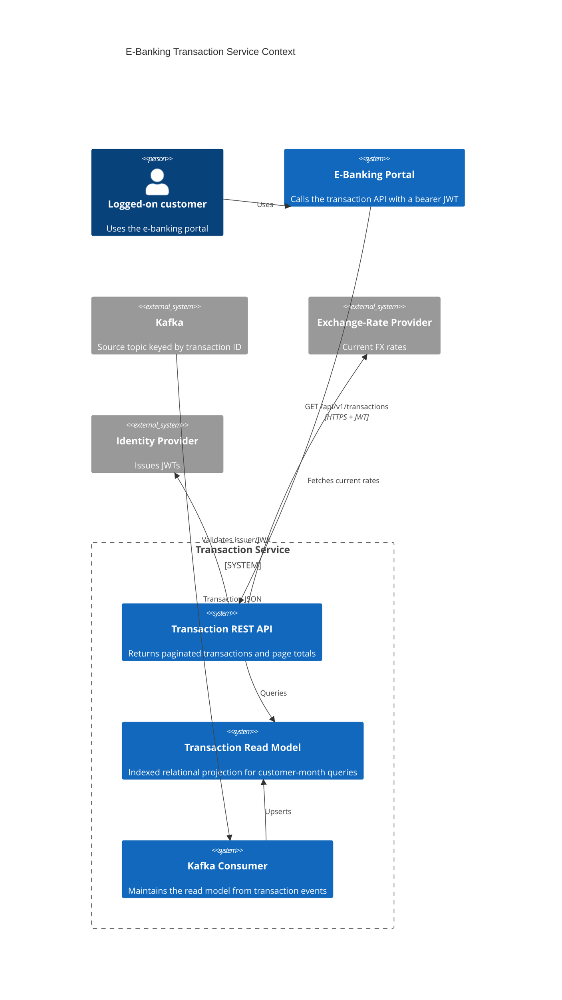
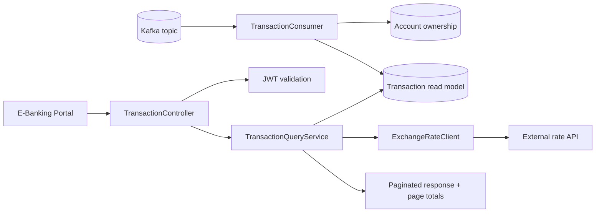
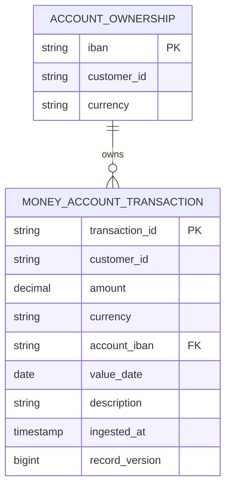

# Architecture

## C4 Context

## Component Flow

## Data Model

The read model is indexed by `(customer_id, value_date desc, transaction_id)` to support the main access pattern: authenticated customer, calendar month, deterministic pagination.
